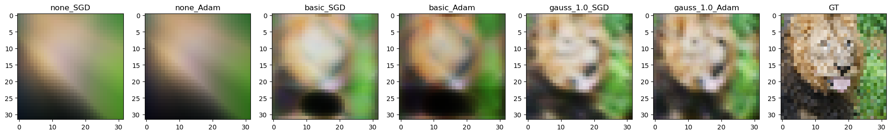
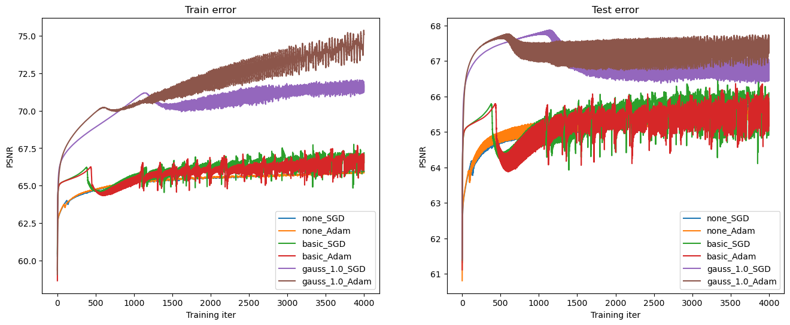
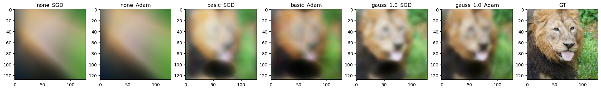
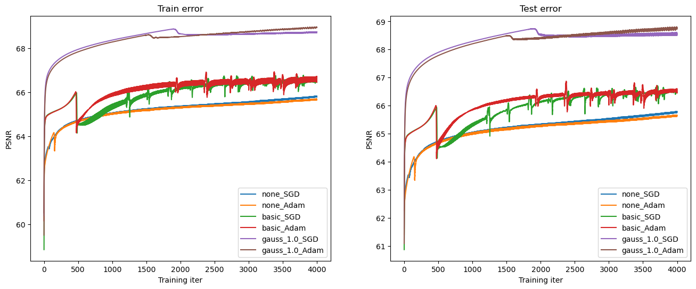
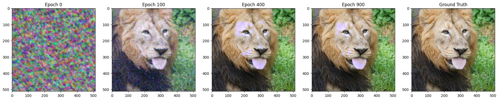
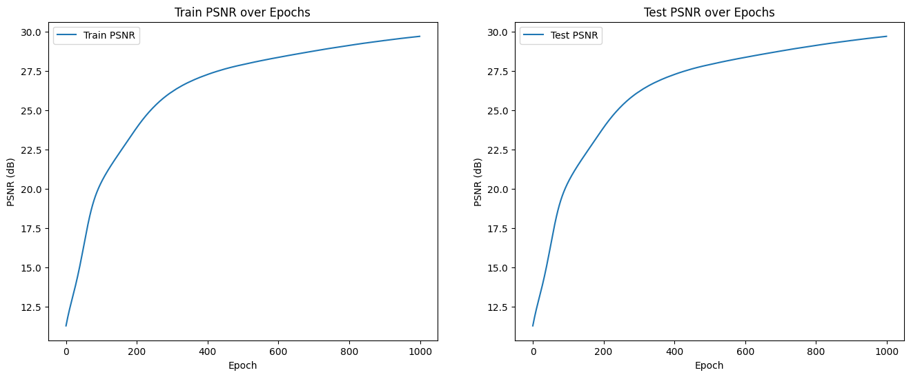
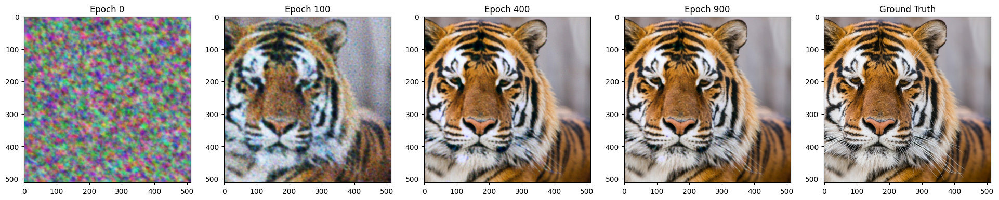
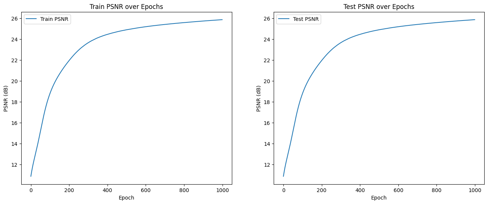
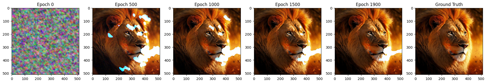
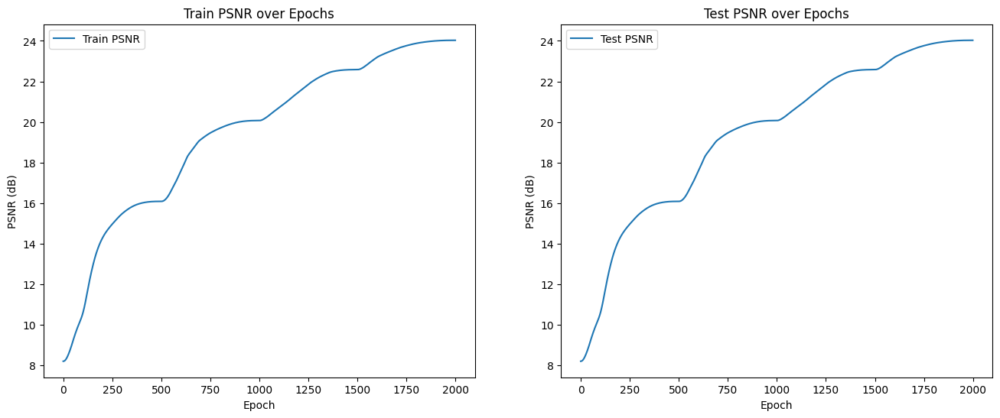

# Gaussian Fourier Features for Image Memorization 

<hr>

## Contents

1. [Highlights](#Highlights)
2. [Results](#Results)
    - [MLP From Scratch](#mlp-from-scratch)
    - [PyTorch Implementation](#PyTorch)
3. [References](#references)

<hr>

## Highlights
This project is based on the course *Deep Learning for Computer Vision* at UIUC (CS 444 Spring 2024). In this project, we will implement multi-layer neural networks and backpropagation from scratch to “memorize” an image. Specifically, we will write our own forward and backward pass and train a four-layer network with SGD and Adam optimizers. The network’s weights will be updated to minimize a mean square error (MSE) loss between the original and reconstructed images. Then, we will use a traditional PyTorch framework to improve our model from scratch.

This assignment is based on the following [paper](https://arxiv.org/abs/2006.10739)

</img>

<hr>

## Results
### MLP from Scratch 

**Low-Resolution Reconstruction and PSNR Curves**

</img>

</img>

**High-Resolution Reconstruction and PSNR Curves**

</img>

</img>

### PyTorch Implementation (with Gaussian transforms only)

**High-Resolution Lion**

</img>

</img>

**High-Resolution Tiger**

</img>

</img>

**High-Resolution Lion (#2)**

</img>

</img>

<hr>

## References
```bibtex
@article{tancik2020fourfeat,
    title={Fourier Features Let Networks Learn High Frequency Functions in Low Dimensional Domains},
    author={Matthew Tancik and Pratul P. Srinivasan and Ben Mildenhall and Sara Fridovich-Keil and Nithin Raghavan and Utkarsh Singhal and Ravi Ramamoorthi and Jonathan T. Barron and Ren Ng},
    journal={NeurIPS},
    year={2020}
}
```


